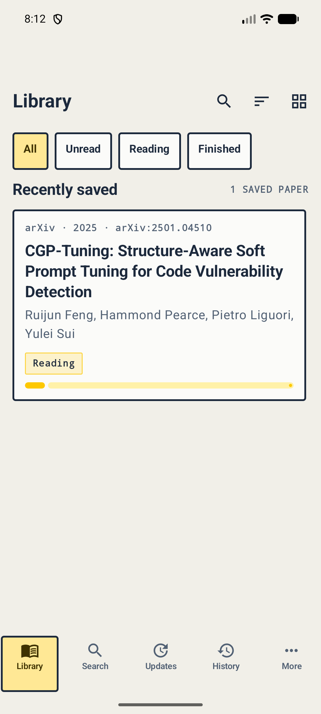
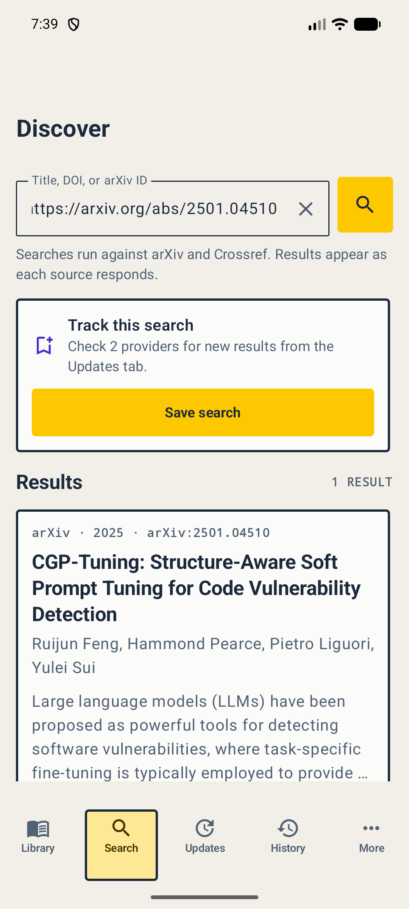
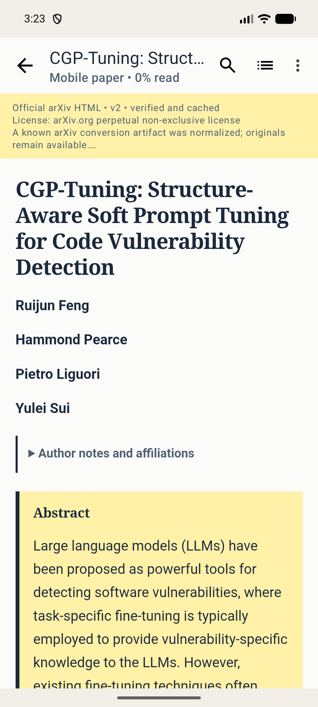

# PaperReader

[](https://github.com/ImAno177/PaperReader/actions/workflows/android-ci.yml)
[](LICENSE)

Status: pre-1.0. PaperReader supports Android 9 or newer.

## About

PaperReader is an open-source, local-first Android app for discovering, collecting, reading, and
tracking scientific papers. It turns supported papers into a responsive, mobile-readable document
and keeps the original PDF as a fidelity fallback.

The current host behavior is recorded in [`docs/SPEC.md`](docs/SPEC.md). Release history is tracked in
[`CHANGELOG.md`](CHANGELOG.md).

## Highlights

- Search Semantic Scholar, arXiv, and Europe PMC records, enrich exact DOI metadata with
  Crossref, then save papers to an on-device Room library.
- Keep recent searches, inspect provider-specific progress and failures, filter by source, and retry
  an unavailable provider without discarding successful results.
- Search Google inside PaperReader when providers have no match, then hand a selected arXiv URL to
  the installed arXiv source for authoritative API metadata. The app never scrapes result pages.
- Read exact-version arXiv HTML offline with selectable text, figures, tables, MathML, search, a table
  of contents, adjustable typography, reading progress, and exact-document highlights with notes.
- Download verified PDFs and open them in the in-app original-document reader.
- Organize collections, history, bookmarks, saved searches, updates, and metadata backups locally.
- Choose the Neobrutalism visual preset with Material Symbols, or install a complete community theme.
- Add Ed25519-signed community stores, or build isolated source and complete visual-theme extensions with
  the documented SDK.
- Keep private reading data on the device with no analytics, advertising SDK, account, or cloud parser.

## Screenshots

<p align="center">
  
  
  
</p>

## Build

Use JDK 21, Android SDK 36/36.1, and the Gradle wrapper:

```bash
./gradlew :app:assembleDebug
```

The debug APK is written to `app/build/outputs/apk/debug/app-debug.apk`. See
[`docs/TESTING.md`](docs/TESTING.md) for the verification gates,
[`CONTRIBUTING.md`](CONTRIBUTING.md) for the contribution workflow, and
[`docs/ARCHITECTURE.md`](docs/ARCHITECTURE.md) for the supported module boundary.
GitHub Actions publishes APK artifacts and an SPDX JSON software bill of materials for each build.
Extension authors can start with the [`extension-api` guide](docs/EXTENSIONS.md).

## Inspiration

PaperReader takes inspiration from [Mihon](https://mihon.app/)'s local-first library and extension
flows.

## License

Licensed under the [Apache License 2.0](LICENSE). Third-party attributions are listed in
[`NOTICE`](NOTICE) and [`THIRD_PARTY_NOTICES.md`](THIRD_PARTY_NOTICES.md).
