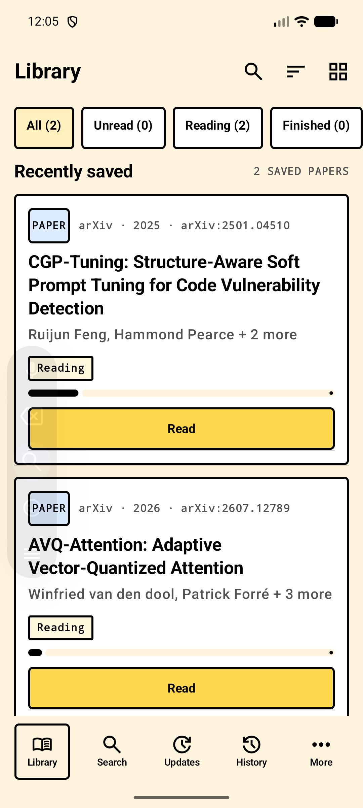
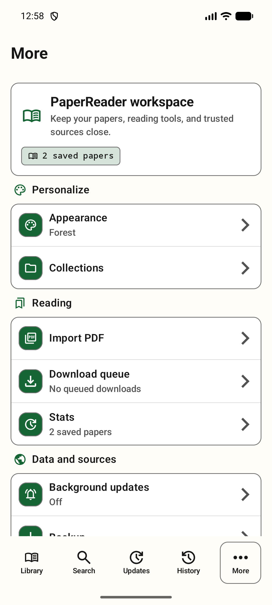
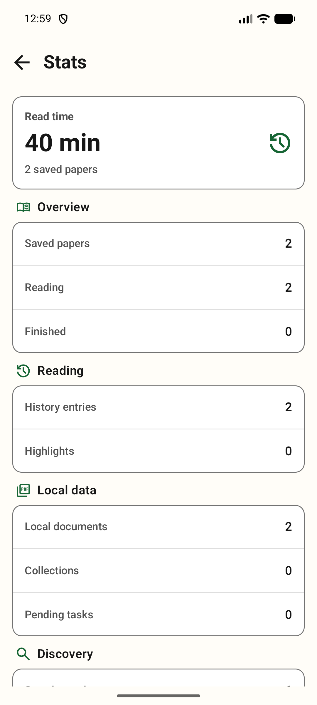
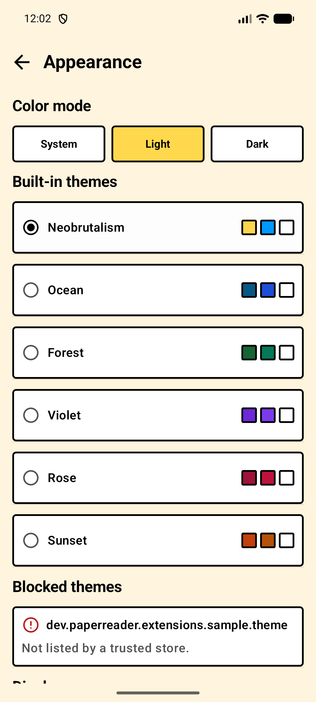
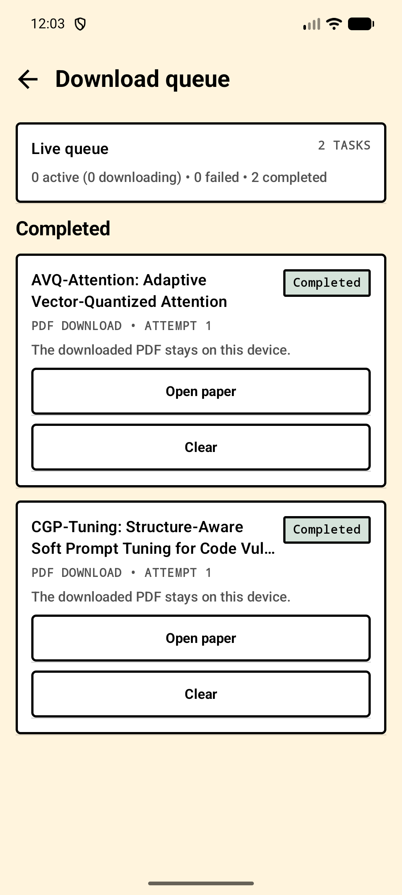
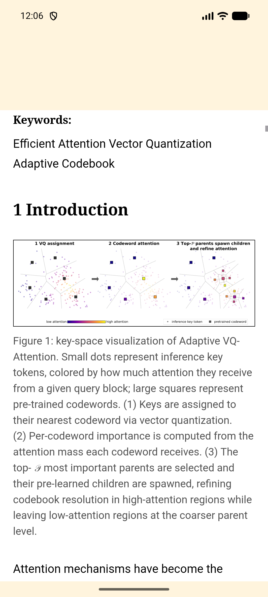
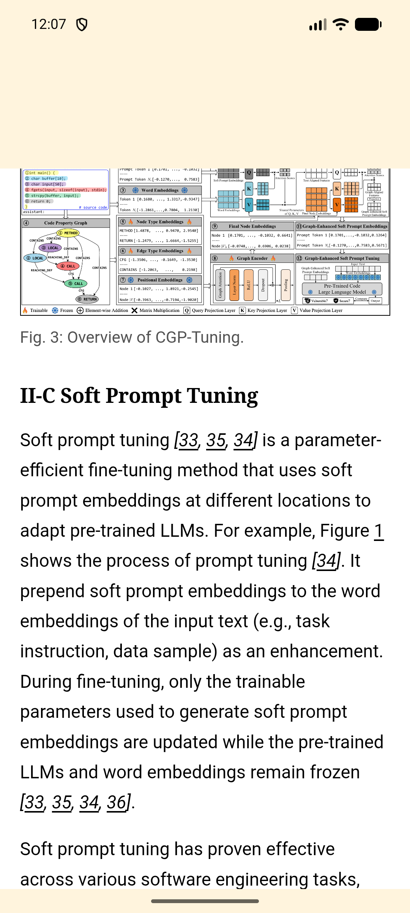

[](https://github.com/ImAno177/PaperReader/actions/workflows/android-ci.yml)
[](LICENSE)

# PaperReader

A local-first Android app for discovering, saving, reading, and tracking scholarly papers.

Status: pre-1.0. PaperReader supports Android 9 (API 28) and newer.

## Table of contents

- [About the project](#about-the-project)
- [Built with](#built-with)
- [Getting started](#getting-started)
- [Usage](#usage)
- [Local emulator audit](#local-emulator-audit)
- [Roadmap](#roadmap)
- [Contributing](#contributing)
- [Security](#security)
- [License](#license)
- [Contact](#contact)
- [Acknowledgments](#acknowledgments)

## About the project

PaperReader keeps paper discovery, metadata, local files, and reading state together on the device.
For supported papers, it downloads an exact-version readable document and its validated assets for
offline reading. The original PDF remains available as the fidelity fallback.

The Android host does not contain provider implementations. Search and content providers are separate
source APKs that communicate through a versioned AIDL contract. Theme APKs provide declarative visual
data while the host owns rendering and trust decisions.

### Current capabilities

- Search Semantic Scholar, arXiv, and Europe PMC; use Crossref for exact DOI metadata enrichment.
- Keep provider progress and failures separate, filter by source, and retry an unavailable provider.
- Hand an explicit arXiv result from the in-app Google fallback to the installed arXiv source without
  scraping Google result pages.
- Read exact-version arXiv HTML with selectable text, figures, tables, MathML, find, contents,
  typography controls, progress, citations, highlights, and notes.
- Download the HTML body and same-document assets through separate bounded lanes. The current
  referenced-asset path has no figure-count cap; per-asset limits, SVG checks, retries, and cache
  quotas remain in force.
- Download verified PDFs and open the original document in the in-app PDF reader.
- Organize papers with collections, history, bookmarks, reading status, saved searches, updates,
  and metadata backups.
- Choose the original Neobrutalism preset or five built-in color themes, with independent
  System/Light/Dark modes.
- Install signed source and theme extensions without loading third-party code into the host process.
- Keep reading data local. The default app has no analytics, advertising SDK, account, or cloud parser.

## Screenshots

<p align="center">
  
  
  
</p>

## Local emulator audit

These captures are from the local API 36 emulator (`emulator-5554`) after the readable-document
and Download queue smoke run on 2026-09-07. They are evidence of the visible runtime states, not
mockups; the detailed results and limits are recorded in `docs/TESTING.md`.

<p align="center">
  
  
  
  
  
  
  
</p>

The same local run captured Search results, Paper Detail, a live PDF download percentage, and both
the Attention and CGP-Tuning readers in `docs/screenshots/`. The screenshots do not contain
credentials or uploaded paper files. The final debug APK and the connected-test evidence remain
local release artifacts; no GitHub-hosted test run was used for this audit.

## Built with

| Area | Technology |
| --- | --- |
| Android UI | Kotlin, Jetpack Compose, and Material 3 |
| Local data | Room and WorkManager |
| Network | OkHttp with bounded requests and cancellation |
| Reading | Sanitized local HTML in a network-blocked WebView and the Android PDF viewer |
| Extensions | Versioned AIDL over separate Android packages and UIDs |

## Getting started

### Prerequisites

- JDK 21
- Android SDK Platform 37
- Android SDK Build-Tools 36.1.0
- A device or emulator running Android 9 or newer

Provider-backed search also needs network access and the corresponding signed source extensions. No
account or hosted PaperReader service is required for local library data.

### Build the debug APK

From the repository root, use the Gradle wrapper:

```powershell
.\gradlew.bat :app:assembleDebug
```

The APK is written to `app/build/outputs/apk/debug/app-debug.apk`.

### Run the local verification gate

The host gate runs unit tests, lint, and debug APK assembly in one Gradle invocation:

```powershell
.\gradlew.bat hostUnitTest hostLint :app:assembleDebug
```

Connected Android checks and the six-paper readable-asset audit are documented in
[`docs/TESTING.md`](docs/TESTING.md). They are local checks on a declared emulator; GitHub Actions
does not replace that device audit.

## Usage

1. Install compatible official source extensions from [PaperReader-sources](https://github.com/ImAno177/PaperReader-sources),
   or build an extension against the local API using [`docs/EXTENSIONS.md`](docs/EXTENSIONS.md).
2. Search by title, phrase, DOI, arXiv identifier, PMID, or PMCID. Open a result to inspect its
   provider, version, access, and license details.
3. Choose `Save` to add the work to the local Library. Saving keeps the work, provider manifestation,
   and local files as separate records.
4. Choose `Read` for the mobile document when a verified readable manifestation is available. Use
   the original PDF action when exact publication layout is required.
5. Reopen retained documents from the Library when offline. An annotation remains attached to the
   exact document hash where it was created.

The public task guides and screen notes are available in the [PaperReader site](https://imano177.github.io/paperreader-site/).

## Roadmap

These items are deferred from the current pre-1.0 scope:

- Isolated TeX conversion and broader PDF reflow or OCR support.
- Annotation export and cross-revision annotation re-anchoring.
- Resumable downloads and user-selectable storage locations.
- Automatic backup and sync.

Deferred behavior is not presented as a shipped feature in the app or documentation.

## Contributing

Start with a focused issue or pull request. Keep the module boundary `:app -> :logic ->
:extension-api`, update the relevant documentation, and run the local gates before requesting review.
Provider changes belong in the separate [PaperReader-sources](https://github.com/ImAno177/PaperReader-sources)
repository.

See [`CONTRIBUTING.md`](CONTRIBUTING.md) for branch, fixture, migration, and review requirements.

## Security

Report vulnerabilities through [`SECURITY.md`](SECURITY.md). Do not include exploit details in a
public issue. Extension APKs and store indexes are verified before installation, and third-party
extension code never runs inside the host process.

## License

PaperReader is licensed under the [Apache License 2.0](LICENSE). Third-party attributions are listed
in [`NOTICE`](NOTICE) and [`THIRD_PARTY_NOTICES.md`](THIRD_PARTY_NOTICES.md).

## Contact

Use the [PaperReader issue tracker](https://github.com/ImAno177/PaperReader/issues) for bug reports,
implementation questions, and feature discussions.

## Acknowledgments

- The README structure follows the [Best-README-Template](https://github.com/othneildrew/Best-README-Template).
- PaperReader builds on Android, Kotlin, Jetpack Compose, Room, WorkManager, OkHttp, and the Android
  WebView and PDF components.
